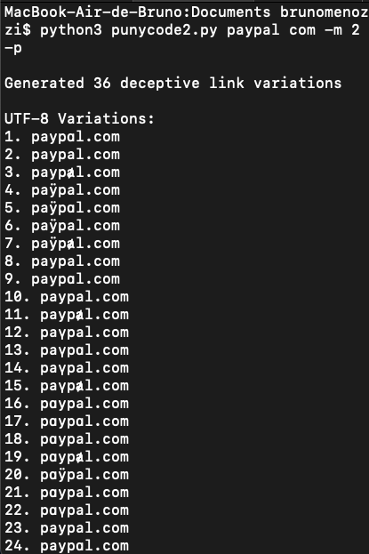

# ZPuny  
_A small and simple Red Team Tool for Cybersecurity Awareness Testing_  

  
*(Example of homoglyph substitutions for "paypal.com")*

## 📌 Overview
This tool generates **visually deceptive domain names** using Punycode/homoglyph substitutions to simulate advanced phishing attacks. Designed for **ethical red team engagements**, it helps organizations test their defenses against homograph attacks and improve user awareness training.

**Key Features:**
- 🎭 50+ cross-script homoglyph substitutions (Cyrillic, Greek, IPA symbols)
- 🔢 Configurable substitution complexity (`-m` parameter)
- 📁 HTML report generation with live Punycode links
- 🖥️ Clean terminal output for quick analysis
- ⚠️ Built-in ethical use warnings

## 🛠️ Installation
```bash
git clone https://github.com/zeroc00I/zpuny.git
cd zpuny
```

## Requirements:
Python 3.6+ (No external dependencies)

## 🚀 Basic Usage

```bash
python puny.py example com -m 2 -p
```
Output:
Generated 18 deceptive link variations

UTF-8 Variations:
1. exаmple.com
2. example.cοm
3. exɑmple.com
...
18. еxample.com

Output saved to phishing_report.html

## ⚙️ Advanced Options
```bash
python puny.py targetdomain org -m 3 -o custom_report.html
```

## Parameter	Description
```
-m MAX_SUBSTITUTIONS	Maximum character replacements (1-5)
-o OUTPUT	Custom HTML report filename
-p	Print UTF-8 variations to terminal
```

## 🔍 Why Punycode? (Security Context)
Punycode (RFC 3492) enables internationalized domain names (IDNs) by converting Unicode to ASCII prefixed with xn--. 
While crucial for global internet access, this can enable:

- Homograph Attacks: аррӏе.com vs apple.com
- Evasion Techniques: Bypass domain blocklists
- Credential Harvesting: Fake login pages
- Red teams use this tool to:
  - Test email filter detection capabilities
  - Identify vulnerable systems without IDN safeguards
  - Demonstrate phishing risks to stakeholders

## 📜 Release History
- v1.0 (Oct 2023): Initial release focused on Cyrillic substitutions
- v1.2 (Nov 2023): Added diacritical marks and IPA symbols
- v2.0 (Current): Multi-substitution engine and HTML reporting
- Created during BlackHat 2023 workshops to address growing IDN phishing threats.

### 📄 License
Apache 2.0 - Must include original disclaimer in derivative works

### 🔴 Disclaimer: This tool is for authorized security testing and education only. Misuse for phishing or illegal activities violates license terms and international laws. Developers assume no liability for unauthorized use.
